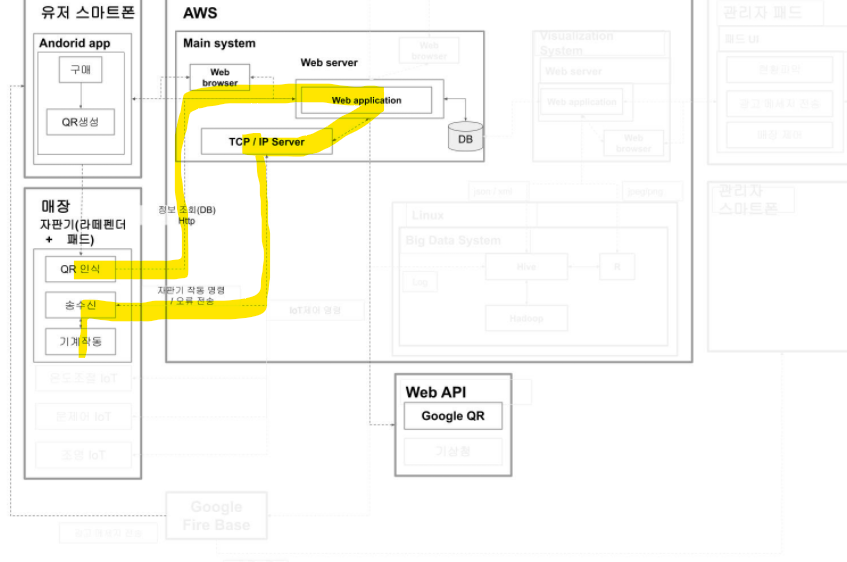

# QR 인식 -> IoT작동 까지

## 시스템 아키텍쳐

> QR  인식 -> Web application 작동 -> TCP/IP 전송 -> IoT 수신 -> 센서 작동

## 각파일 저장위치

[tcpipWebCon](./tcpipWebCon) -> AWS에 war로 전개

[TCPIPServer](./TCPIPServer) -> jar 파일 생성 후 AWS에서 실행

[ArduinoBackup.zip](./ArduinoBackup.zip) -> IoT장비

[_1113_Led.ino](./_1113_Led.ino) -> 아두이노

## [tcpipWebCon](./tcpipWebCon)

> web application 을 담고 있음.
>
> 웹페이지로 IoT 구동 / QR 인식후 IoT 구동 / 웹피이지를 통한 IoT 정지 등의 코드 포함

QR인식한 Json 데이터를 Post방식으로 받아서 처리합니다. 콘솔에 데이터를 찍은 후 IoT장비로 보내게 됩니다. 현재 IoT장비로 연결 부분은 컨트롤러 내의 다른 곳에는 있으나, 데이터를 받는 부분에는 되어 있지 않습니다.

Json데이터를 받는 컨트롤러는 getJson.mc입니다.

실행을 위해서 **TCP/IP서버 구동**이 필수입니다.

메인컨트롤러의 `sendTarget`부분의 IP 부분은 꼭 확인하여 줍시다.

## [TCPIPServer](./TCPIPServer)

> TCP/IP 서버입니다.

 IoT 장비 / Web / 기타 클라이언트 연동까지 확인하였습니다. 주석은 깨졌으며, 형태님 코드를 참고하였습니다.

## [ArduinoBackup.zip](./ArduinoBackup.zip)

> IoT장비(라떼펜더)에서 이클립스로 실행해야 하는 프로젝트 입니다.

Serial 통신을 통해 Can 또는 Sensor로 부터 데이터를 받을 수 있고 이를 TCP/IP통신으로 내보낼 수 있습니다. 이와 반대되는 시나리오도 가능합니다.

## [_1113_Led.ino](./ArduinoCodes/_1113_Led.ino)

> 아두이노에 전개되어야 하는 코드입니다.

`s`를 받으면 불이 켜지고, `t`를 받으면 불이 꺼집니다.

## [ambientLight.txt](./ArduinoCodes/ambientLight.txt)

> 빛이 강할때 불이 약해지고, 빛이 약할떄 불이 세짐

손님이 앞으로 다가왔을때, 매대(?)의 조명 세기가 세진다고 가정함.

## [multiCommand.txt](./ArduinoCodes/multiCommand.txt)

> 여러개의 커멘드를 동시에 받아 처리한다.

`id:value&id:value`의 구조만 유지해서 입력하면 동작한다.

## 앞으로 진행방향

### 20201118

> AWS에서 구동은 잘됨

- [ ] Sensor에서 `Ready`이외의 메세지 받아서 서버에서 처리하기
- [ ] 여러 시나리오에서 구동해보기(현재는 IoT가 꺼져있어도 `Ready`전역 변수에 넣어놨기 떄문에.) -> 메세지 요청 보내는 방식으로 바꿔야할듯.