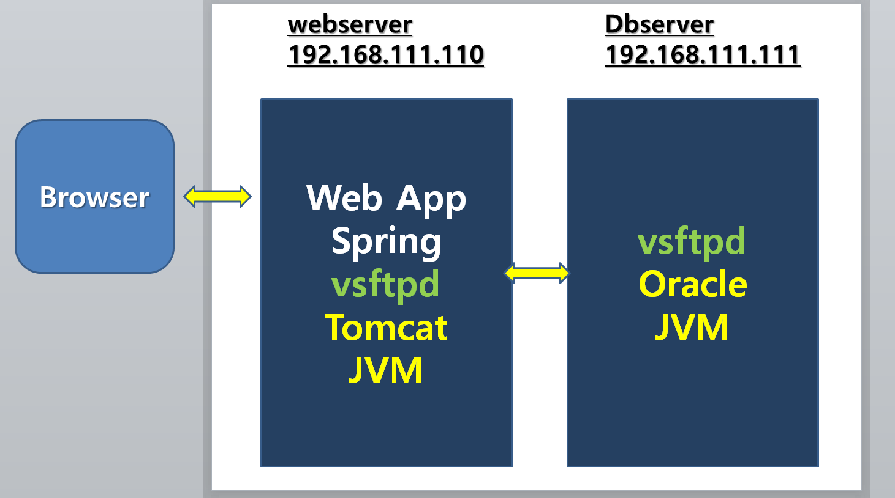

## FTP 설치

P669 - FTP 설치

* vsftpd 설치

  * yum  -y  install  vsftpd

  

* systemctl  restart   vsftpd

     systemctl  enable  vsftpd

* vi  /etc/vsftpd/vsftpd.conf

     19, 29,  33,  35   line 수정 (맨앞 # 제거 35line 은 인사말 추가 - 없어도됨)

  p674

* chown  ftp.ftp  /var/ftp/pub

  ​    systemctl  restart   vsftpd

* window client program 설치

  ​    알드라이브 설치

  ​    192.168.111.101   (포트설정)

  ​    익명으로접속

* 알드라이브 설치 후에 (이클립스 WAR 파일을 Linux에서 실행시키기 위해 )

  이클립스에 Dynamic Web Project 생성(파일명: linux) -> [index.html](http://index.html/) 생성 -> 'linux' Warfile
  알드라이브 /pub 에 넣는다. /var/ftp/pub를 ls 하면 [linux.war](http://linux.war/) 가 있다.

  
  stoptomcat
  cp [linux.war](http://linux.war/) /usr/local/[apache-tomcat-9.0.37/webapps/](http://apache-tomcat-9.0.37/webapps/)
  cd /usr/local/[apache-tomcat-9.0.37/webapps/](http://apache-tomcat-9.0.37/webapps/)
  ls
  mv ROOT ROOT_BACK
  ls
  mv [linux.war](http://linux.war/) [ROOT.war](http://root.war/)
  ls
  starttomcat

  /usr/local/[apache-tomcat-9.0.37/webapps/](http://apache-tomcat-9.0.37/webapps/)에 자동으로 ROOT 를 생성

