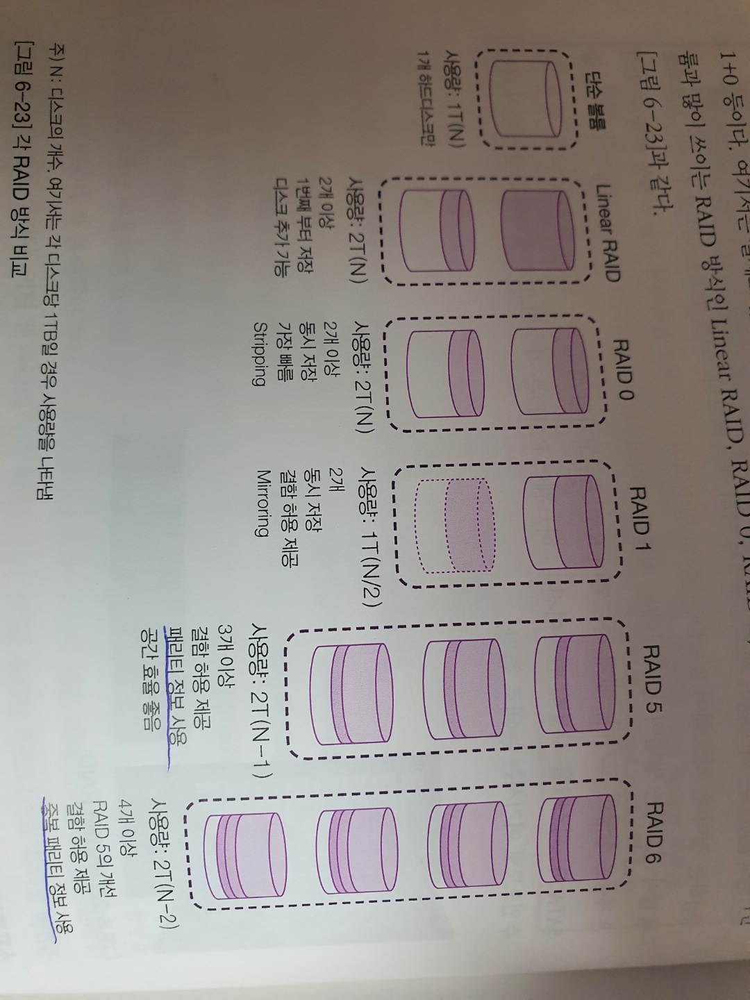
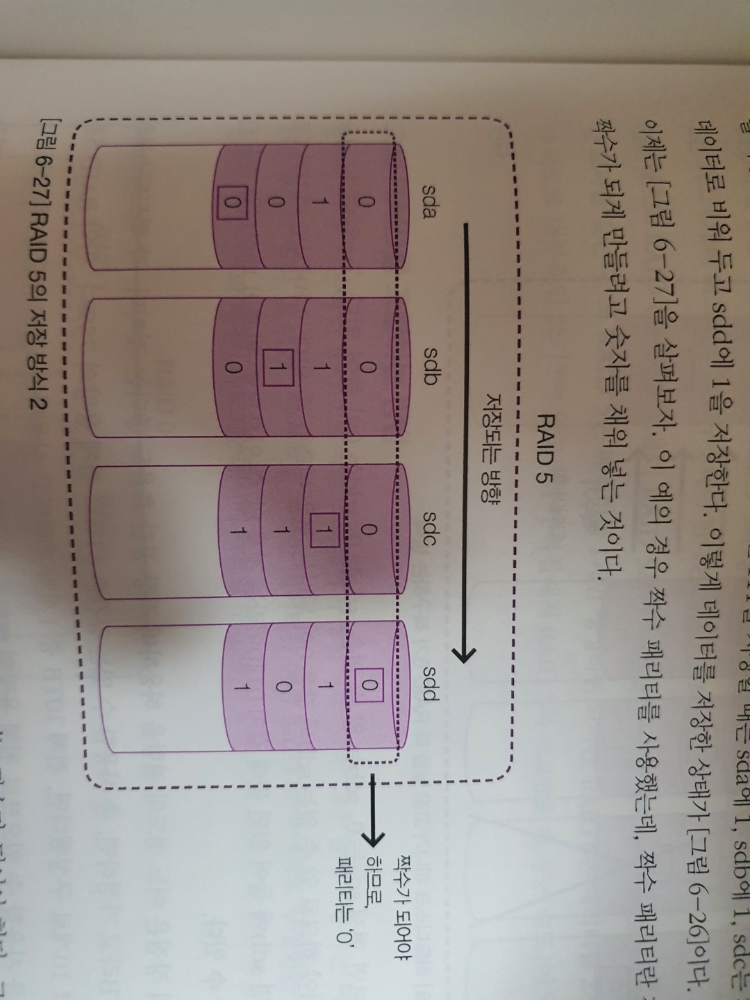

## 04_하드디스크 관리 333p

> IDE 장치와 SCSI 장치 구성

- IDE : 메인보드 슬롯에는 각각 2개의 IDE 장치 장착 가능 (총 4개)

- Server 에는 주로 SCSI(small computer system interface) 하드디스크

  SCSI = 주변기기를 컴퓨터에 연결할 때, 직렬 방식으로 연결하기 위한 표준을 말한다.

   SCSI = 최대 16개 장치 연결가능

  SA-SCSI(Serial Attached SCSI , 줄여서 SAS) = 최대 65,535개 연결가능


> Linux 하드디스크 추가 과정

1. 하드디스크 장착(생성)

2. fdisk  (파티션 할당)

   ```Linux
   #fdisk /dev/sdb
   
   Command : n  (새로운 파티션 분할)
   
   Select : p  (Primary 파티션 선택)
   
   Parititon Nuber : 1  (파티션 번호 1번 - 최대 4개까지 생성가능)
   
   First sector : `enter`
   
   Last sector : `enter`
   
   Command : p
   
   Command : w
   ```

3. mkfs.ext4 (포멧)

4. mdadm   --create  /dev/md1   --level=linear  --raid-devices=2  /dev/sdb1   /dev/sdc1

   (하단에 명령어 설명)

5. mkdir /xxxx  (mount 할 디렉토리 생성)

6. mount  (mdadam 한 파일 ex - md1)

   mount /dev/md1   /raid1

7. vi /etc/fstab  

   ex) /dev/md16    /raid16    ext4    defaults    0    0

8. df 으로 작동여부 확인

9. reboot


## 여러개의 하드디스크를 하나처럼 사용하기

> RAID (Redundant Array of Inexpensive/Independent Disks)

- 여러 개의 하드디시크를 하나의 하드디스크 처럼 사용하는 방식. 비용을 절감하면서도 신뢰성을 높이며 성능까지 향상 가능.



* Linear RAID = 1번째 하드디스크 부터 순서대로 저장
* RAID0 = 2개 이상의 하드디스크에 동시에 저장 (ex- 1/2, 1/2 나눠서 동시에 저장됨 )
* RAID1 = 같은 정보를 동시에 저장 (복제)
* RAID5~6 = 패리티 정보 사용 갯수의 차이 RAID0 처럼 동시에 저장하되, 패리티 정보를 사용하여 결함 허용 제공. 




* RAID 1+0 / 1+6 과 같이 신뢰성을 높이기 위해 조합해서 사용을 많이 한다.


> mdadm 명령어

* mdadm   --create  /dev/md1   --level=linear  --raid-devices=2  /dev/sdb1   /dev/sdc1
  * level = 0  -> raid0
  * level = 1 -> raid1
  * level = 5  -> raid 5
  * level = 6 -> raid 6
  * devices = 장치 갯수
* mdadm --stop  /dev/md1
* mdadm --run  /dev/md1
* mdadm --detail  /dev/md1
* mdadm --detail  --scan
* mdadm /dev/md1  --add  /dev/sdg1  (하드 추가할때)  - Raid1 과 같이 하나의 하드디시크가 삭제되어도 작동, 데이터가 보존되었을때 새로운 하드를 추가하는 방법

stop 하기전에는 **umount** 를 먼저 해야한다.

