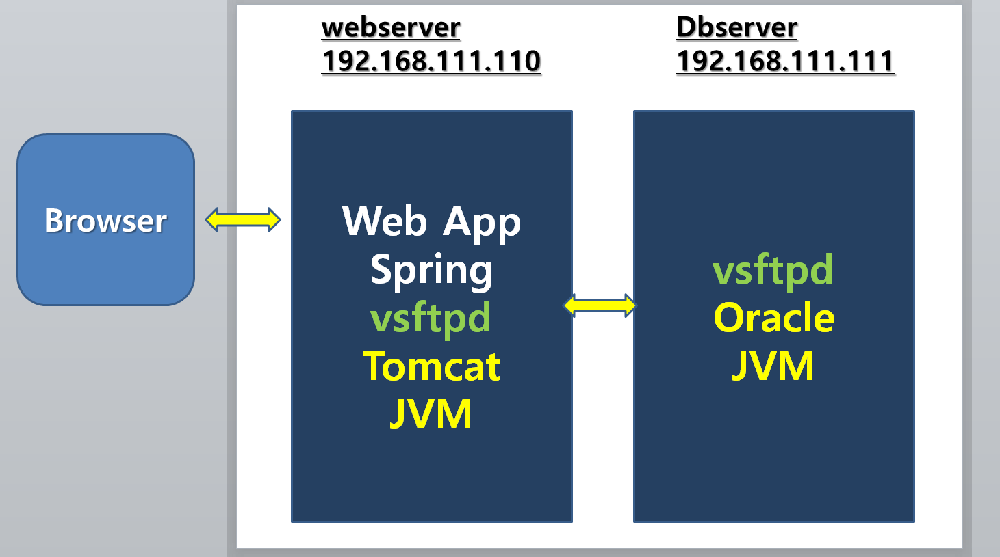

\1. Linux 복재

\2. hostname: webserver, ip: 192.168.111.110

hostname: dbserver, ip: 192.168.111.111

/etc/hosts

\3. firewall 해제

\- systemctl stop firewall

\- systemctl disable3 firewall

\4. webserver

\- jdk

\- tomcat - conf/server.xml, 8080 -> 80

\- wsftpd

\5. dbserver

\- jdk

\- oracle

\- wsftpd

