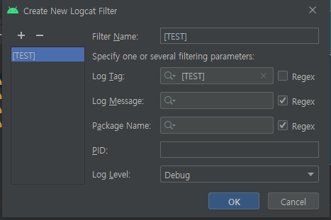
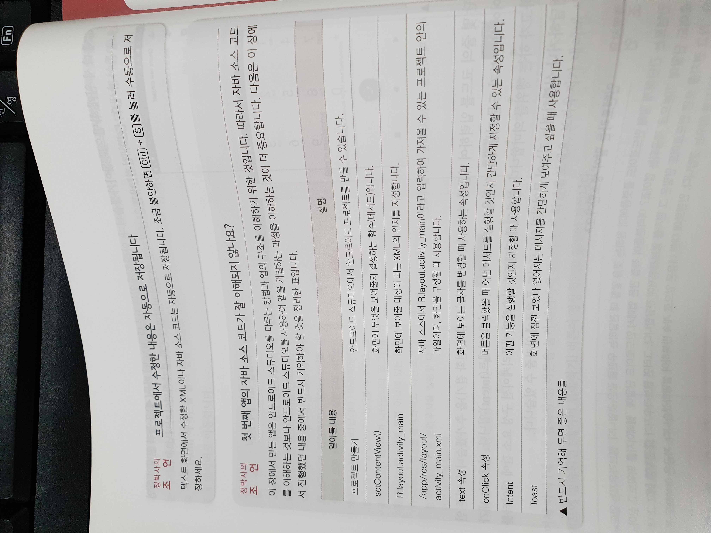
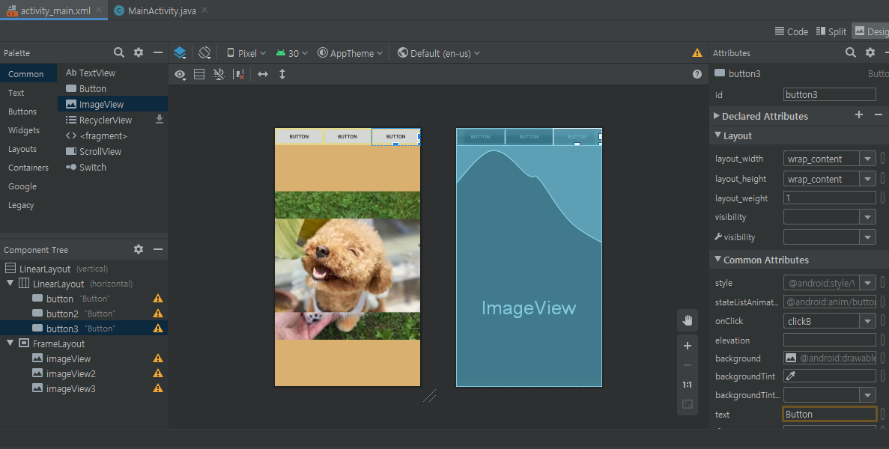

## 안드로이드 1일차

> 스마트폰은 리눅스 기반이다.

* android-studio-ide-193.6821437-windows   파일 설치

* 삼성 스마트폰 USB 드라이버 설치
* User 이름이 한글로 되어있으면 설치가 안될 수 도 있다.


> p 25 SDK Tools

> Android Emulator 는 가상의 스마트폰을 PC에 만들겠다는 뜻
>
> Google Play services 에서 대표적인 서비스는 구글맵이다.

* 완전히 삭제하고 싶은 경우  C  -> 사용자에 들어있는 .android, .AndroidStudio4.0, AppData(local 안에 Android, Sdk) 를 삭제 한 뒤 다시 깔아야 한다. (p21)

* 설치이후 configure -> SDK Manager 에서 원하는 안드로이드 버젼을 추가로 설치 해야 한다.

* 안드로이드 9 -> show Packge Detail 에서 TV, china, wear OS 빼고 다 체크


안드로이드는 전형적인 MVC 모델로 이루어져 있다.

안드로이드 스튜디오에서 xml 은 화면 구성 전부를 담당

java 파일은 모든 컨트롤 로직을 담당

r.java 는 모든 변수를 담당 (자체적으로 관리 됨)


(p35) 가상 에뮬레이터는 컴퓨터 사양에 따라 설치 ( 사양이 낮으면 스마트폰으로 진행 가능 )


SDK 설치 이후 SDK Tools 에서 구글 플레이 서비스 / Google USB 드라이버 / 인텔 x86 Emulator Accelerator 체크 후 설치


> Htper-V 를 체크할 경우에는 VMWare 가 작동하지 않는다

 Emulator Accelerator  설치 안될 경우 / SDK - Google x86_ARM Atom System Image 도 마찬가지

제어판 -> 프로그램 -> 프로그램 기능 -> 왼쪽 윈도우즈 기능 켜기/끄기 -> Hyper-V 체크 후 확인 -> 재부팅 후 다시 설치 

(최신 컴퓨터인 경우에는 따로 설치를 하지 않아도 가상 스마트폰 구성이 가능하다.)


configure -> AVD 매니저 -> Pixel 2 로 만들기

configure -> Setting -> editor -> font 필요시 세팅


gradle 은 쉽게 말해 maven의 업그레이드 버젼 lib을 관리함.


1. build.gradle

2. **AndroidManifest.xml - 전체적인 app의 환경설정 파일**
3. **MainActivity.java**  - **코드**

4. **activity_main.xml - 화면을 관장**

5. R.java - 전체적인 자원(리소스)을 보관하는 곳

   5 번은 따로 건들지 않을 것이다. 


### 아이콘 바꾸기/이미지 넣기


AndroidManifest  에서 아이콘 변경

icon 변경은 mipmap 에 이미지 넣기


activity_main.xml 에 이미지 넣기

이미지는 res-> drawable  이 관리 v24로 저장하면 안된다.

배경은 해상도를 어느 버젼에 맞춰야 할지 애매하기 때문에 많이 사용하지는 않는다.


```java
// AndroidManifest

<?xml version="1.0" encoding="utf-8"?>
<manifest xmlns:android="http://schemas.android.com/apk/res/android"
    package="com.example.myapplication">

    // call 함수 퍼미션 에러 해결하기 위해 uses 추가해야한다.
    <uses-permission android:name="android.permission.CALL_PHONE"/>
    <application
        android:allowBackup="true"
        android:icon="@mipmap/icon"
            // label 은 직접 이름을 바꾸어도되고 string.xml  은 res->valuse에 있다.
        android:label="Android App"
        android:roundIcon="@mipmap/icon"
        android:supportsRtl="true"
        android:theme="@style/AppTheme">
        <activity android:name=".MainActivity">
            <intent-filter>
                <action android:name="android.intent.action.MAIN" />

                <category android:name="android.intent.category.LAUNCHER" />
            </intent-filter>
        </activity>
    </application>

</manifest>
```


```java
// MainActivity.java

    
package com.example.myapplication;

import androidx.appcompat.app.AppCompatActivity;

import android.os.Bundle;
import android.util.Log;
import android.view.View;
import android.widget.ImageView;
import android.widget.Toast;

public class MainActivity extends AppCompatActivity {
	// 배경화면에 넣은 이미지 id
    ImageView himg;
    Button button2;
    @Override
    protected void onCreate(Bundle savedInstanceState) {
        super.onCreate(savedInstanceState);
        setContentView(R.layout.activity_main);
        // id로 이미지 파일 가지고 오기 R.id 에 위젯 관련 파일들이 저장된다.
        himg = findViewById(R.id.himg);
        // button 글씨를 string.xml 에 있는 내용으로 바꾸기 위해
        button2 = findViewById(R.id.button2);
    }
	// 함수를 만들어주면 activity_main.xml 에 onclick 에 함수가 생긴다.
    public void clickBt(View view){
        // 버튼클릭시 지정한 사진이 사라지게 함
        himg.setVisibility(View.INVISIBLE);
		// 클릭시 버튼2 글씨바뀜
        button2.setText(R.string.bt_text);
		// 로그 찍는법 아래 6: Logcat에 로그가 찍힘
        Log.d("[Test]","--------------");
        
        // Toast 생성
        Toast.makeText(this, "Hello", Toast.LENGTH_SHORT).show();
    }
    
    public void clickBt2(View view){
        Intent intent = new Intent(Intent.ACTION_VIEW,
                                   Uri.parse("http://m.naver.com"));
        startActivity(intent);

    }
    public void clickBt3(View view){
        Intent intent = new Intent(Intent.ACTION_VIEW, 
                                   Uri.parse("tel:010-9878-9838"));
        startActivity(intent);

    }
    
}


// 한가지 함수로 버튼들 기능 나누기 (코드의 간소화)
    public void clickBts(View view){
        Intent intent = null;
        if(view.getId() == R.id.button2){
            intent = new Intent(intent.ACTION_VIEW,
                                Uri.parse("http://naver.com"));
        }else if(view.getId() == R.id.button3){
            intent = new Intent(intent.ACTION_VIEW, 
                                Uri.parse("tel:010-2342-0394"));
        }else if(view.getId() == R.id.button4){
            intent = new Intent(intent.ACTION_CALL, 
                                Uri.parse("tel:010-2342-0394"));
               if(checkSelfPermission(Manifest.permission.CALL_PHONE) 
                  != PackageManager.PERMISSION_GRANTED){
             return;
            }
        }
        // ACTION_CALL 같은 경우 permition 허가가 나야한다. AndroidManifest.xml에 
        //   <uses-permission android:name="android.permission.CALL_PHONE"/> 를 추가해야한다. 퍼미션 체크여부를 onCreate 에 추가를 해야 정상 작동 된다. - 추후 배울것임
        startActivity(intent);
    }


```

> 내가 지정한 로그를 보고 싶으면 Log.d 후에 하단 Logcat 우측 Edit Filter Configuration 에서 필터처리를 해주어야 한다.







### UI

Layout 변경 , gravity , layout_gravity 를 사용하여 위치, Layout 변경 / layout_margin, padding  변경

이중 레이아웃 쓸때는 Layout_weight 사용하기


### 프레임 레이아웃 P158~

> 버튼눌렀을때 화면 전환 or 이미지 전환

```java
package com.example.p158;

import androidx.appcompat.app.AppCompatActivity;

import android.os.Bundle;
import android.view.View;
import android.widget.ImageView;

public class MainActivity extends AppCompatActivity {
    ImageView imageView,imageView2,imageView3;
    @Override
    protected void onCreate(Bundle savedInstanceState) {
        super.onCreate(savedInstanceState);
        setContentView(R.layout.activity_main);
        imageView = findViewById(R.id.imageView);
        imageView2 = findViewById(R.id.imageView2);
        imageView3 = findViewById(R.id.imageView3);
    }

    public void clickB(View view){
        if(view.getId() == R.id.button){
            imageView.setVisibility(View.VISIBLE);
            imageView2.setVisibility(View.INVISIBLE);
            imageView3.setVisibility(View.INVISIBLE);
        }else if(view.getId() == R.id.button2){
            imageView.setVisibility(View.INVISIBLE);
            imageView2.setVisibility(View.VISIBLE);
            imageView3.setVisibility(View.INVISIBLE);
        }else if(view.getId() == R.id.button3){
            imageView.setVisibility(View.INVISIBLE);
            imageView2.setVisibility(View.INVISIBLE);
            imageView3.setVisibility(View.VISIBLE);
            // 사진바꾸기 위해서는 아래 코드
            imageView.setImageResource(R.drawable.d2);
        }
    }

}
```




### 168~169P 문제 풀어보기 (정답확인하기)

> P168 두개의 이미지뷰에 이미지 번갈아 보여주기

```java
package org.techtown.mission03;

import android.os.Bundle;
import android.view.View;
import android.widget.Button;
import android.widget.ImageView;

import androidx.appcompat.app.AppCompatActivity;

public class MainActivity extends AppCompatActivity {
    ImageView imageView01;
    ImageView imageView02;

    @Override
    protected void onCreate(Bundle savedInstanceState) {
        super.onCreate(savedInstanceState);
        setContentView(R.layout.activity_main);

        imageView01 = findViewById(R.id.imageView01);
        imageView02 = findViewById(R.id.imageView02);

        Button button01 = findViewById(R.id.button01);
        button01.setOnClickListener(new View.OnClickListener() {
            public void onClick(View v) {
                moveImageUp();
            }
        });

        Button button02 = findViewById(R.id.button02);
        button02.setOnClickListener(new View.OnClickListener() {
            public void onClick(View v) {
                moveImageDown();
            }
        });

        moveImageUp();
    }

    private void moveImageDown() {
        imageView01.setImageResource(0);
        imageView02.setImageResource(R.drawable.beach);

        imageView01.invalidate();
        imageView02.invalidate();
    }

    private void moveImageUp() {
        imageView01.setImageResource(R.drawable.beach);
        imageView02.setImageResource(0);

        imageView01.invalidate();
        imageView02.invalidate();
    }

}

```


> P169 Text 입력화면 만들고 글자의 수 표시하기

```java
package org.techtown.mission04;

import android.os.Bundle;
import android.text.Editable;
import android.text.TextWatcher;
import android.view.View;
import android.widget.Button;
import android.widget.EditText;
import android.widget.TextView;
import android.widget.Toast;

import androidx.appcompat.app.AppCompatActivity;

import java.io.UnsupportedEncodingException;

public class MainActivity extends AppCompatActivity {
    EditText inputMessage;
    TextView inputCount;

    @Override
    protected void onCreate(Bundle savedInstanceState) {
        super.onCreate(savedInstanceState);
        setContentView(R.layout.activity_main);

        inputMessage = findViewById(R.id.inputMessage);
        inputCount = findViewById(R.id.inputCount);


        Button sendButton = findViewById(R.id.sendButton);
        sendButton.setOnClickListener(new View.OnClickListener() {
            public void onClick(View v) {
                String message = inputMessage.getText().toString();
                Toast.makeText(getApplicationContext(), "전송할 메시지\n\n" + message, Toast.LENGTH_LONG).show();
            }
        });

        Button closeButton = findViewById(R.id.closeButton);
        closeButton.setOnClickListener(new View.OnClickListener() {
            public void onClick(View v) {
                finish();
            }
        });

        TextWatcher watcher = new TextWatcher() {
            public void onTextChanged(CharSequence str, int start, int before, int count) {
                byte[] bytes = null;
                try {
                    bytes = str.toString().getBytes("KSC5601");
                    int strCount = bytes.length;
                    inputCount.setText(strCount + " / 80바이트");
                } catch(UnsupportedEncodingException ex) {
                    ex.printStackTrace();
                }
            }

            public void beforeTextChanged(CharSequence s, int start, int count, int after) {

            }

            public void afterTextChanged(Editable strEditable) {
                String str = strEditable.toString();
                try {
                    byte[] strBytes = str.getBytes("KSC5601");
                    if(strBytes.length > 80) {
                        strEditable.delete(strEditable.length()-2, strEditable.length()-1);
                    }
                } catch(Exception ex) {
                    ex.printStackTrace();
                }
            }
        };

        inputMessage.addTextChangedListener(watcher);
    }

}

```

